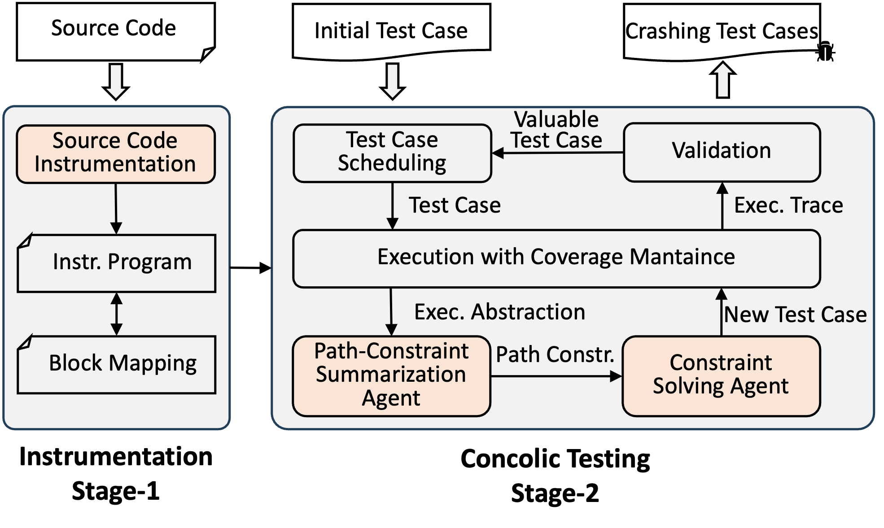
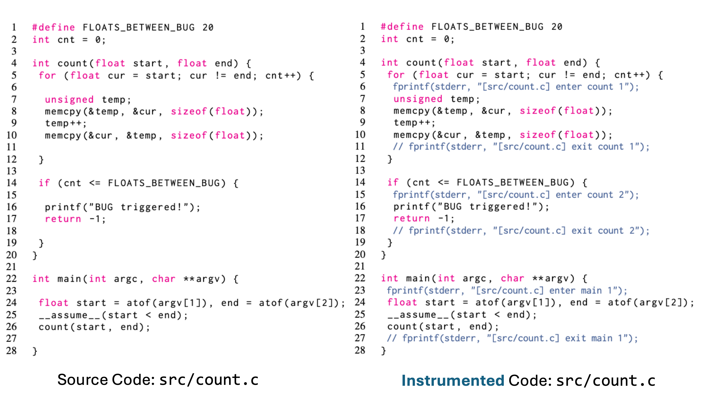
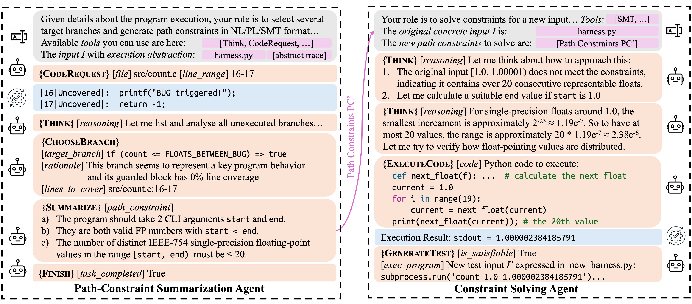

# ConcoLLMic: Agentic Concolic Execution

[](https://www.gnu.org/licenses/gpl-3.0.en.html) [](LICENSE)

**Paper**: [IEEE S&P 2026](https://concollmic.github.io/static/SP26-ConcoLLMic.pdf)

---

ConcoLLMic is the first language- and theory-agnostic concolic executor powered by LLM agents. Unlike traditional symbolic execution tools that require language-specific implementations and struggle with constraint solving, ConcoLLMic:
* **Works with *any* programming language and environment interactions** — supports C, C++, Python, Java, ..., and even multi-language systems; requires no additional environment modeling and handles them efficiently.
* **Handles diverse constraint theories** — including floating-point arithmetic, strings, structured data, and bit-level operations.
* **Achieves superior coverage** — in ~4 hours, ConcoLLMic covers **115%-233%** more branches than state-of-the-art tools like [KLEE](https://klee-se.org) and **81%** more than [AFL++](https://aflplus.plus) running for 48 hours.
* **Finds real bugs** — has already discovered 10+ previously unknown vulnerabilities in real-world softwares.



**How it works**: ConcoLLMic uses LLM agents to
1. instrument code at source level with logging statements like `fprintf(stderr, ...)`;
2. summarize path constraints flexibly in natural language, code, or SMT formulas;
3. solve constraints intelligently — directly reasoning constraints over semantics and delegating to grounded solvers when needed. 

This eliminates the need for hand-crafted language-specific symbolic interpreters and environment modeling as well as expensive constraint solving.

<br clear="right"/>

---

## Table of Contents
- [Workflow Example](#workflow-example)
- [Getting Started](#getting-started)
- [Command Reference](#command-reference)
- [Running Large-Scale Experiments](#running-large-scale-experiments)
- [License](#license)
- [Citation](#citation)

---

## Workflow Example

#### Phase 1: Instrumentation



Example instrumentation of [`src/count.c`](code_example/src/count.c) from [FP-Bench](https://github.com/zhaohuanqdcn/fp-bench), by inserting `fprintf` at key points in the execution. Output in `stderr` allows us to reconstruct the dynamic execution path.

#### Phase 2: Concolic Testing



This shows one round of concolic execution with ConcoLLMic. Compared to conventional tools with *verbose, implementation-level formulas*:
```
start = atof(I[0]) ∧ end = atof(I[1]) ∧ start < end ∧ cur[0] = start ∧ 
(∀ 0 ≤ i < cnt, cur[i] ≠ end) ∧ cur[cnt] = end ∧ cnt ≤ 20
```
ConcoLLMic summarizes the path constraints concisely using *high-level natural-language*:
```
The number of representable FP values in the range must be ≤ 20.
```

---

## Getting Started

### Prerequisites

- Python 3.10 or higher
- API key for Claude-3.7-Sonnet (from Anthropic)

### Installation

1. **Clone the repository**
```bash
git clone https://github.com/ConcoLLMic/ConcoLLMic.git
cd ConcoLLMic
```

2. **Install Python dependencies**
```bash
pip install -r requirements.txt
pip install -r requirements-dev.txt
```

3. **Set up your API key**
```bash
export ANTHROPIC_API_KEY="your_api_key_here"
```

By default, ConcoLLMic uses Claude-3.7-Sonnet. You can configure other models in [`ACE.py`](ACE.py) (see `setup_model()`).

### Running Your First Example

Let's walk through a complete example using a C program from [FP-Bench](https://github.com/zhaohuanqdcn/fp-bench) that counts floating-point values in a range.

#### Step 1: Instrumentation

ConcoLLMic instruments source code by inserting trace statements. For the provided examples, instrumented code is already available in [`code_example/instr/`](code_example/instr/).

To instrument from scratch:
```bash
rm ./code_example/instr/count.c

python3 ACE.py instrument \
    --src_dir ./code_example/src/ \
    --out_dir ./code_example/instr/ \
    --instr_languages c,cpp,python,java
```

**Note**: The `--instr_languages` flag is only used for filtering files by extension. No additional language-specific support is needed.

#### Step 2: Compilation

Compile the instrumented code normally:
```bash
gcc -o ./code_example/instr/count ./code_example/instr/count.c
```

#### Step 3: Concolic Execution

Run the concolic execution agent with a test harness ([`code_example/harness/count.py`](code_example/harness/count.py)):
```bash
python3 ACE.py run \
    --project_dir ./code_example/instr/ \
    --execution ./code_example/harness/count.py \
    --out ./out/ \
    --rounds 2 \
    --parallel_num 3
```

**Parameters**:
- `--project_dir`: Directory containing the instrumented code and the compiled program
- `--execution`: Test harness (a Python script that executes the target program and returns stderr + exit code)
- `--out`: Output directory for generated test cases and logs
- `--rounds`: Number of concolic execution rounds (default: unlimited until coverage plateau)
- `--parallel_num`: Maximum number of concurrent test case generations per round

**Expected cost**: ~$0.40 for 2 rounds with Claude-3.7-Sonnet

**Output**:
- `./out/ConcoLLMic_*.log` — detailed execution log
- `./out/queue/id:*.yaml` — generated test cases with metadata

#### Step 4: View Statistics (Optional)

Analyze testing statistics (tokens used, costs):
```bash
python3 ACE.py run_data --out_dir ./out/
```

#### Step 5: Replay & Coverage (Optional)

To measure code coverage or verify bugs:

1. **Compile the original (non-instrumented) code with coverage**:
```bash
cd ./code_example/src/
gcc --coverage -o count count.c
lcov -z -d .
cd ../../
```

2. **Replay generated test cases**:
```bash
python3 ACE.py replay \
    ./out/ \
    ./code_example/src/ \
    ./coverage.csv \
    --cov_script ./code_example/src/coverage.sh
```

**Output**:
- `./coverage.csv` — time-series coverage data for each test case
- `./code_example/src/count.c.gcov` — line-by-line coverage report

The `gcov` report will show that the bug at line 67 has been triggered.

---

## Command Reference

ConcoLLMic provides a unified CLI interface:

```bash
python3 ACE.py <command> [options]
```

### Main Commands

| Command | Description |
|---------|-------------|
| `instrument` | Instrument source code for tracing |
| `run` | Execute concolic testing |
| `replay` | Replay generated test cases |
| `instrument_data` | Analyze instrumentation statistics |
| `run_data` | Display testing statistics and costs |

For detailed options, run:
```bash
python3 ACE.py <command> --help
```

Or visit the [documentation](https://concollmic.github.io/docs.html).

---

## Running Large-Scale Experiments

To reproduce the paper's evaluation results or run ConcoLLMic on real-world benchmarks, see the [experiments/README.md](experiments/README.md).

We provide Docker-based setups for:
- **C/C++ benchmarks**
- **Multi-language systems**
- **Comparison with other tools** — KLEE, KLEE-Pending, AFL++, SymCC, SymSan


---

## License

This project is dual licensed:

- **Non-commercial use**: Licensed under [GPLv3](https://www.gnu.org/licenses/gpl-3.0.en.html) for academic and non-commercial purposes
- **Commercial use**: Please contact the authors for commercial licensing

For full license details, see [LICENSE](LICENSE).

For commercial licensing inquiries, contact:
- Abhik Roychoudhury (abhik@nus.edu.sg)
- Cristian Cadar (c.cadar@imperial.ac.uk) 
- Jonathan Tan (jonathan_tan@nus.edu.sg)

---

## Citation

```bibtex
@inproceedings{luo2026concollmic,
  title={Agentic Concolic Execution},
  author={Luo, Zhengxiong and Zhao, Huan and Wolff, Dylan and Cadar, Cristian and Roychoudhury, Abhik},
  booktitle={2026 IEEE Symposium on Security and Privacy (S\&P)},
  pages={1--19},
  year={2026},
  organization={IEEE}
}
```

