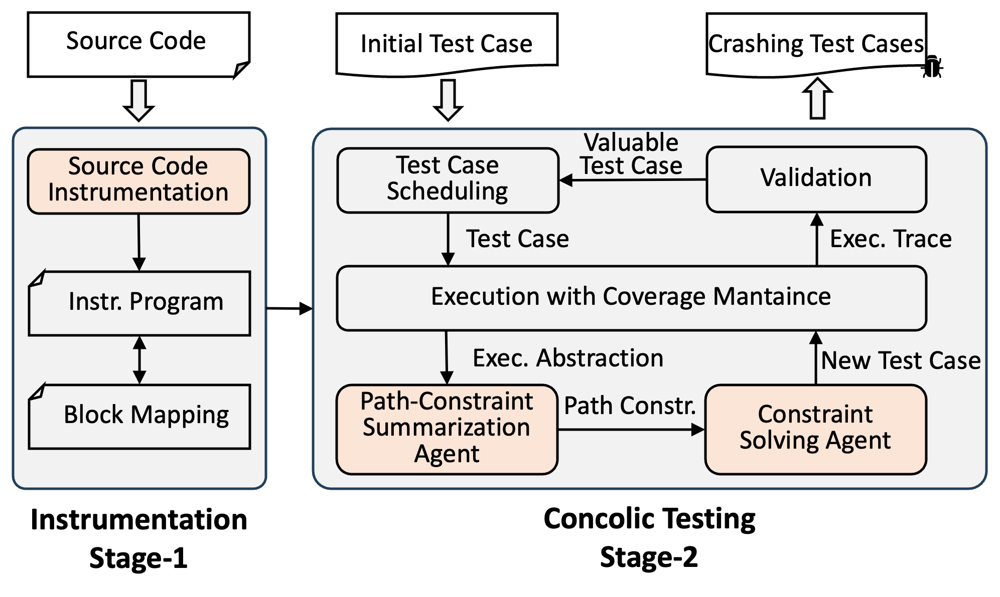

# ConcoLLMic: Agentic Concolic Execution

[](https://www.gnu.org/licenses/gpl-3.0.en.html) [](LICENSE)

## Overview

[ConcoLLMic](https://concollmic.github.io/) is an LLM agent that performs concolic (*conc*rete + symb*olic*) testing. It can generate test cases for *any* environment and language (even *polyglot* systems)! 

In our testing on C/C++ programs, ~4h run of ConcoLLMic covers **230+%** and **80+%** more branches on average than [KLEE](https://klee-se.org) and [AFL++](https://aflplus.plus) in 48 hours, respectively. 




### Highlights

* It performs source-code-level instrumentation for *any* language. No more warnings on compilation or incomplete environment modeling!

* It uses *flexible representations* (natural language, code, SMT) to capture path constraints, and generates *readable* test cases.

* It *minimizes hallucination* with real executions, coverage tracking, and tool use.


## Demo: Floating-point theory in C

#### Phase 1: Instrumentation


Example instrumentation of [`src/count.c`](code_example/src/count.c) from [FP-Bench](https://github.com/zhaohuanqdcn/fp-bench), by inserting `fprintf` at key points in the execution.
Output in `stderr` allows us to reconstruct the dynamic execution path.

#### Phase 2: Concolic Testing


This shows one round of concolic execution with ConcoLLMic. 
Compared to conventional tools which verbose formulas:
```
start = atof(I[0]) /\ end = atof(I[1]) /\
start < end /\ cur[0] = start /\ 
(for all 0 ≤ i < cnt, cur[i] != end) /\ 
cur[cnt] == end /\ cnt ≤ 20
```
ConcoLLMic summarizes the path constraints consicely and solves for an input:

```
The number of representable FP values in the range must be ≤ 20.
```


## Quick Start

You can run ConcoLLMic from a single entry point:

```
python3 ACE.py [subcommand] [options]
```

It supports three main use cases: 
* (1) `instrument` the source code, 
* (2) `run` the concolic testing agent, and 
* (3) `replay` and examine the generated tests (e.g. for coverage).

There are also different utilility functions for reporting statstics. 
For all supported commands and options, see the documentation on our [website](https://concollmic.github.io/docs.html).

**Step 0.** Set up the Python environment by running:
```bash
pip install -r requirements.txt
pip install -r requirements-dev.txt
```
By default, ConcoLLMic uses `claude-3-7-sonnet`, and requires a proper `ANTHROPIC_API_KEY` in the environment. You can do so by running
```bash
export ANTHROPIC_API_KEY="YOUR_KEY_HERE"
```

**Step 1.** Instrument the source code. For our working examples, instrumented code is already provided in [`./code_example/instr/`](./code_example/instr/). If you want to re-instrument them, run

```bash
python3 ACE.py instrument \
    --src_dir ./code_example/src/ \
    --out_dir ./code_example/instr/ \
    --instr_languages python,java,c,cpp
```

Note: `instr_languages` here is only used as filters for file suffixes. No additional language-specific support is needed.

**Step 2.** Compile the instrumented code like what you would do for a normal program.
```
gcc -o ./code_example/instr/count ./code_example/instr/count.c
```

**Step 3.** Launch the concolic execution agent. Here, we run the [test harness](./code_example/harness/count.py) for 2 rounds with 3 parallel queries. It costs ~$0.40 with Claude-3.7.

```bash
python3 ACE.py run \
    --project_dir ./code_example/instr/  \
    --execution ./code_example/harness/count.py \
    --out out --rounds 2 --parallel_num 3
```

At the end, you will be able to see the log in `./out/ConcoLLMic_*.log` and the details of generated test cases in `./out/queue/id:*.yaml`.

Optionally, you may want to view the testing statistics (e.g. costs, time) by running

```bash
python3 ACE.py run_data ./out/
```

**Step 4.** Replay generated tests for coverage / debugging. Taking collecting coverage as an example, first, compile the program with `GCOV` enabled:

```bash
cd ./code_example/src/
gcc --coverage -o count count.c
lcov -z -d .
cd ../../
```

Then, replay the test cases to collect coverage data with a [coverage script](./code_example/src/coverage.sh):
```bash
python3 ACE.py replay ./out/ ./code_example/src/ ./coverage.csv \
    --cov_script ./code_example/src/coverage.sh
```

This will generate a summary at `coverage.csv` and the detailed coverage at `./code_example/src/count.c.gcov`. The `gcov` file would indicate that the bug at line 67 has been successfully triggered.

## Reproducing Results

To reproduce results in our paper or to run real-world projects, see the [experiments](experiments/README.md) for more details.

## License

This project is dual licensed:

- **Non-commercial use**: Licensed under [GPLv3](https://www.gnu.org/licenses/gpl-3.0.en.html) for academic and non-commercial purposes
- **Commercial use**: Please contact the authors for commercial licensing

For full license details, see [LICENSE](LICENSE).

For commercial licensing inquiries, contact:
- Abhik Roychoudhury (abhik@nus.edu.sg)
- Cristian Cadar (c.cadar@imperial.ac.uk) 
- Jonathan Tan (jonathan_tan@nus.edu.sg)

